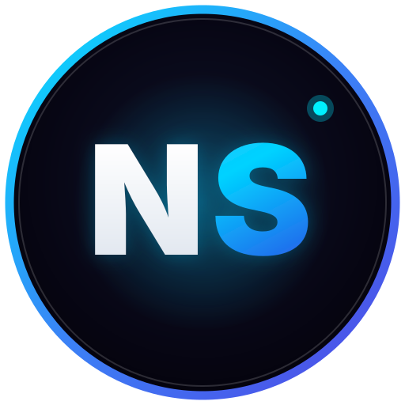

<div align="center">
  

  # NextSite — Presença Digital de Alto Padrão

  [](https://nextsitemk.vercel.app)
  [](https://developer.mozilla.org/pt-BR/docs/Web/HTML)
  [](https://developer.mozilla.org/pt-BR/docs/Web/CSS)
  [](https://developer.mozilla.org/pt-BR/docs/Web/JavaScript)

  <p align="center">
    <strong>Landing page comercial e institucional de alto padrão com engenharia visual moderna e foco cirúrgico em conversão de leads e clientes.</strong>
  </p>

  <p align="center">
    <a href="https://nextsitemk.vercel.app" target="_blank"><strong>🌐 Acessar Site Oficial »</strong></a>
  </p>
</div>

---

## 🎯 Sobre o Projeto

O **NextSite** é uma experiência web completa focada na comercialização de presença digital profissional para autônomos, prestadores de serviço e empresas. Desenvolvido com foco extremo em performance, estética dark refinada e ergonomia mobile.

### ✨ Destaques & Funcionalidades
- **Engenharia Visual Moderna:** Efeitos de glassmorphism, iluminação radial e microinterações pensadas para transmitir credibilidade imediata.
- **Mobile-First & Responsividade:** Otimizado meticulosamente para toque, velocidade de carregamento e navegação em qualquer tamanho de tela.
- **Portfólio Interativo:** Demonstração visual de entregas anteriores e cases.
- **Simulador de Investimento:** Calculadora e tabela dinâmica de planos para auxiliar o tomador de decisão.
- **Funil de Conversão Integrado:** Botões de chamada para ação estratégicos direcionando para WhatsApp.

---

## 🛠️ Tecnologias Utilizadas

- **HTML5 Semântico:** Acessibilidade e SEO otimizado.
- **CSS3 Moderno:** Flexbox, Grid, Variáveis CSS, Animações e Backdrop Filters.
- **JavaScript Vanilla:** Navegação fluida, comportamento de menus e lógica de simulação.
- **Vercel:** Hospedagem global de alta disponibilidade com CDN.

---

## 🚀 Como Executar Localmente

1. Clone o repositório:
```bash
git clone https://github.com/MurilloK14/NextSite.git
```
2. Abra a pasta do projeto:
```bash
cd NextSite
```
3. Abra o arquivo `index.html` no seu navegador ou utilize a extensão **Live Server** no VS Code.

---

Desenvolvido por [Murillo Kennedy](https://github.com/MurilloK14).
